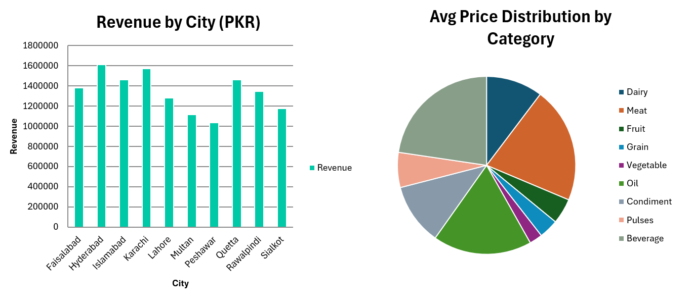

# Hi there, I'm Innocent Watsala 👋

<div align="center">
  
</div>

---

## 👨‍💻 About Me

I'm a data analyst building a strong technical foundation in **Excel**, **SQL**, and **Python**, with a specialization in **data cleaning** and **exploratory data analysis (EDA)**.

- 🌍 Based in **United Arab Emirates**
- 📊 Currently focused on: Data cleaning, Excel analytics, and hospital data analysis
- 🎯 Goal: Become a confident, job-ready **Junior Data Analyst**
- 📚 Always learning and improving through hands-on projects


# 🇵🇰 PK Foods Price Intelligence Dashboard | 2025

> **Real-Time Food Price Analytics across 10 Pakistani Cities**  
> 1,100 Records · 35 Food Items · 9 Categories · PKR 13.4M Total Revenue Tracked

---

## 📌 Project Overview

This project delivers a comprehensive **Excel-based Food Price Intelligence System** for Pakistan's major urban markets. It tracks, analyzes, and visualizes food prices per kilogram across 10 cities, enabling market-level insights on pricing trends, volatility, and revenue distribution.

The dashboard was built entirely in **Microsoft Excel** using structured data modeling, pivot tables, and advanced charting — no code required.

---

## 📊 Dashboard Preview

### 🗺️ Main Dashboard — PK Foods Price Intelligence


> The main dashboard shows KPI cards (Total Records, Revenue, Avg Price/Kg), a revenue breakdown by city, and average price by category — all in a dark-themed, professional layout.

---

### 📈 Revenue by City & Category Distribution



> **Left:** Bar chart comparing total revenue (PKR) across all 10 cities — Hyderabad leads at PKR 1.6M.  
> **Right:** Pie chart showing average price distribution by food category — Beverage and Meat hold the largest shares.

---

## 🏙️ Key Metrics at a Glance

| Metric | Value |
|---|---|
| 📋 Total Records | 1,100 transactions |
| 💰 Total Revenue (PKR) | 13,423,064 |
| ⚖️ Avg Price / Kg | PKR 372 |
| 🏆 Top Revenue City | **Hyderabad** — PKR 1,608,801 |
| 🐟 Most Expensive Item | **Fish (Pomfret)** — PKR 1,113/kg avg |
| 📊 Items Priced Above Avg | 29.9% |

---

## 🗂️ File Structure

```
📁 PK_Food_Price_Intelligence/
│
├── 📊 PK_FOOD_PRICE_PER_KG-project1.xlsx     ← Core dataset (1,100 records)
├── 📊 Source_Market_Survey_PK.xlsx           ← Raw market survey data
│
├── 📈 chart_data.xlsx                        ← Chart source data
├── 📈 City_Coverage_Performance.xlsx         ← City-level performance metrics
├── 📈 Monthly_KPI_tracker.xlsx               ← Monthly KPI tracking
│
├── 🔍 gap_Analysis.xlsx                      ← Price gap & market gap analysis
├── 🔍 Price_Level.xlsx                       ← Price level classification
├── 🔍 Price_Review_per_Kg.xlsx               ← Per-kg price review breakdown
├── 🔍 Volatility_of_price_in_PK_FOOD_PRICE.xlsx ← Price volatility analysis
│
├── 🖼️ Pk_Food_project_dashboard.png          ← Dashboard screenshot
├── 🖼️ Chart_Data.png                         ← Revenue & category charts
│
└── 📄 README.md                              ← You are here
```

---

## 🏙️ Revenue by City (PKR)

| City | Total Revenue | % Share | Avg Price/Kg | Status |
|---|---|---|---|---|
| Hyderabad | 1,608,801 | 12.0% | 417.6 | 🏆 HIGHEST |
| Karachi | 1,568,588 | 11.7% | 421.0 | ✅ ACTIVE |
| Islamabad | 1,460,893 | 10.9% | 343.8 | ✅ ACTIVE |
| Quetta | 1,459,146 | 10.9% | 399.7 | ✅ ACTIVE |
| Faisalabad | 1,382,163 | 10.3% | 347.9 | ✅ ACTIVE |
| Rawalpindi | 1,342,984 | 10.0% | 409.4 | ✅ ACTIVE |
| Lahore | 1,279,284 | 9.5% | 349.4 | ✅ ACTIVE |
| Sialkot | 1,174,601 | 8.8% | 368.8 | ✅ ACTIVE |
| Multan | 1,114,521 | 8.3% | 325.3 | ✅ ACTIVE |
| Peshawar | 1,032,082 | 7.7% | 338.3 | ⚠️ LOWEST |
| **TOTAL** | **13,423,064** | **100%** | | |

---

## 🥩 Average Price by Category (PKR/Kg)

| Rank | Category | Avg Price/Kg | Max | Min | Records |
|---|---|---|---|---|---|
| 1 | Beverage | 911.6 | 1,185.1 | 638.1 | 48 |
| 2 | Meat | 847.8 | 1,102.1 | 593.5 | 174 |
| 3 | Oil | 721.7 | 938.1 | 505.2 | 65 |
| 4 | Condiment | 450.7 | 585.9 | 315.5 | 62 |
| 5 | Dairy | 413.8 | 537.9 | 289.7 | 94 |
| 6 | Pulses | 256.6 | 333.5 | 179.6 | 102 |
| 7 | Fruit | 185.6 | 241.3 | 129.9 | 184 |
| 8 | Grain | 141.9 | 184.5 | 99.3 | 180 |
| 9 | Vegetable | 94.9 | 123.4 | 66.5 | 191 |

---

## 📋 Workbooks Explained

### 1. `PK_FOOD_PRICE_PER_KG-project1.xlsx` — Core Dataset
The master data file containing all 1,100 price records across 10 cities and 35 food items. This is the single source of truth for all analysis.

### 2. `Source_Market_Survey_PK.xlsx` — Market Survey
Raw survey data collected from ground-level market sources across Pakistan, feeding into the cleaned dataset.

### 3. `City_Coverage_Performance.xlsx` — City Performance
City-by-city performance metrics including revenue share, record count, and active status tracking.

### 4. `Monthly_KPI_tracker.xlsx` — KPI Tracker
Time-series KPI monitoring to track how average prices, volumes, and revenue evolve month over month.

### 5. `gap_Analysis.xlsx` — Gap Analysis
Identifies the price gap between the cheapest and most expensive cities/items, highlighting where arbitrage or supply chain inefficiencies exist.

### 6. `Price_Level.xlsx` — Price Classification
Classifies each food item into price tiers (Low / Medium / High / Premium) based on their per-kg cost relative to the national average.

### 7. `Price_Review_per_Kg.xlsx` — Per-Kg Review
Detailed review of per-kilogram pricing broken down by item, city, and category — useful for procurement and policy analysis.

### 8. `Volatility_of_price_in_PK_FOOD_PRICE.xlsx` — Price Volatility
Statistical analysis of price fluctuations across the dataset, identifying which food categories and cities experience the most price instability.

### 9. `chart_data.xlsx` — Chart Source Data
Pre-aggregated data tables used to power the charts and visual elements in the main dashboard.

---

## 💡 Key Insights

- 🏆 **Hyderabad** generates the highest revenue (12%) and has the highest average price per kg (PKR 417.6)
- 🐟 **Fish (Pomfret)** is the single most expensive item at PKR 1,113/kg on average
- 🥤 **Beverages** are the priciest category overall (PKR 911.6/kg avg), followed by Meat and Oil
- 🥦 **Vegetables** are the most affordable category (PKR 94.9/kg avg) with the highest record count (191)
- ⚠️ **Peshawar** has the lowest total revenue and the lowest average price per kg — a potential under-served market
- 📊 Nearly **30% of items** are priced above the national average, indicating significant price dispersion

---

## 🛠️ Tools Used


- **Microsoft Excel** — Data modeling, pivot tables, conditional formatting, charts
- **Data Source** — Pakistan_Food_Prices_Cleaned (primary survey data)
- **Visualization** — Bar charts, pie charts, KPI scorecards, dark-theme dashboard layout

---

## 👤 Author

Built as part of an Excel Analytics portfolio project demonstrating end-to-end data analysis, dashboard design, and market intelligence reporting using Microsoft Excel.

---

*Last updated: 2025 | Data covers 10 major Pakistani cities*

---
---

## 🛠️ Tools & Technologies


---

## 📈 GitHub Stats

<div align="center">
  
  
</div>

---

## 🗺️ My Learning Roadmap

- [x] Excel Fundamentals & Advanced Formulas
- [x] Data Cleaning Techniques
- [x] SQL Basics
- [ ] Python for Data Analysis (pandas, numpy)
- [ ] Data Visualization (Matplotlib, Seaborn)
- [ ] Power BI Dashboards
- [ ] Real-world capstone project

---

## 🤝 Connect With Me

[](https://linkedin.com/in/YOUR-LINKEDIN-HERE)
[](mailto:YOUR-EMAIL-HERE)

---

<div align="center">
  <i>"Every dataset tells a story. My job is to find it."</i>
</div>
